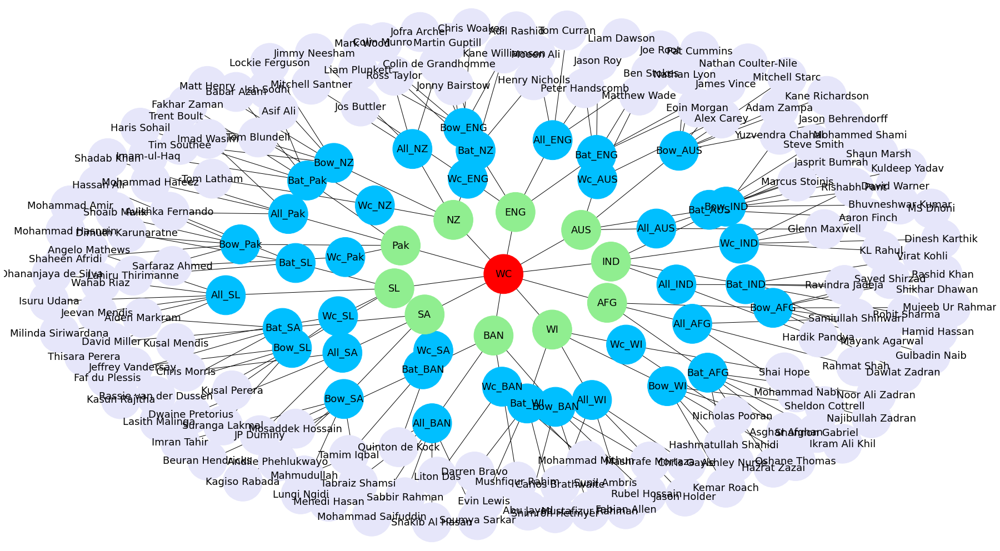

### KG_code
Code for creating a Knowledge Graph and visualizing it using Networkx. 
**Dataset used :** 
Custom made dataset (**ckt_links.csv**) 
**Graph structure :** 
 
There is a **central node** (WC) connected to different **countries** which is further connected to different **roles** of the players (Batsman,Bowlers,All-rounders,Wicket keepers) which is connected to each individual **players**. 
